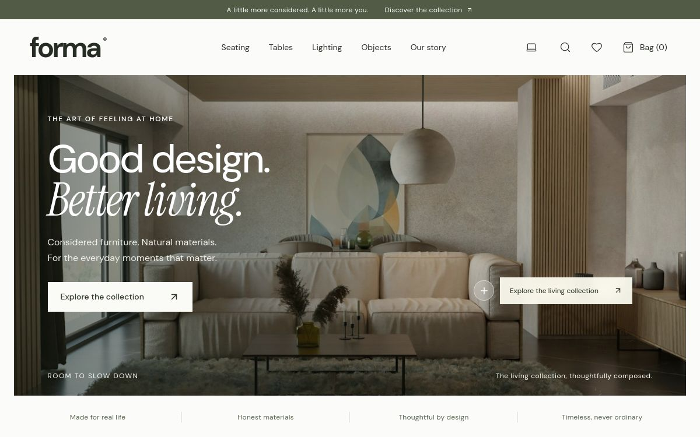
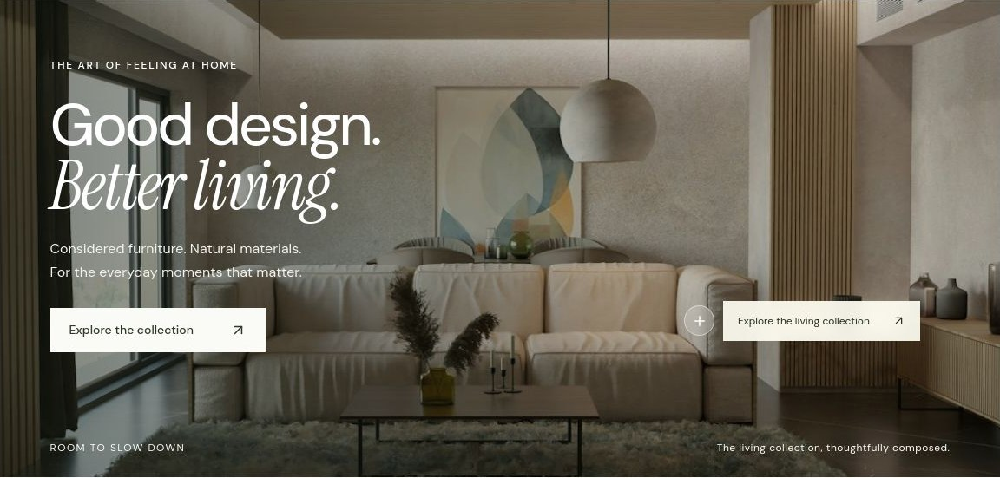
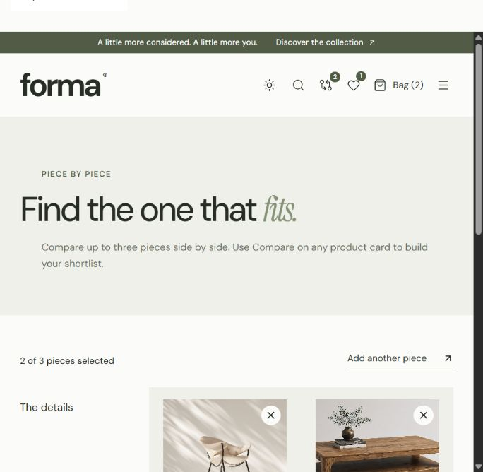

# FORMA — Considered furniture

A responsive furniture ecommerce concept, built with React, TypeScript, Vinext and accessible Radix/Shadcn primitives.

**[Visit the live FORMA store →](https://forma-furniture-studio.aboodi19.chatgpt.site/)**

## Website preview

### Hero detail

### Compare pieces

## Included
- Nineteen sample products across seating, tables, lighting and objects, with material, finish and dimension details.
- Dedicated collection pages and shareable individual product pages with related pieces.
- A complete shop page, curated room edits, and shareable About, Delivery & Returns, and Care Guide pages.
- Category and price filters, sorting and live catalog search.
- Side-by-side comparison for up to three products, saved in this browser, plus a material-specific care guide.
- Product dialogs, finish selection, quantities and saved pieces.
- Persistent browser shopping bag and wishlist with validated local storage.
- Delivery options and a clearly labelled demo checkout.
- Keyboard-accessible dialogs, mobile navigation and reduced-motion support.
- Device, light and dark appearance choices; device theme is the default, and the chosen mode is saved in this browser.
- WebMCP search and add-to-bag tools with input validation.

## Development
- Install: `npm run install:ci`
- Preview: `npm run dev`
- Typecheck: `npx tsc --noEmit`
- Catalog tests: `node --experimental-strip-types --test tests/catalog.test.mjs`
- Lint: `npm run lint`
- Production build: `npm run build`

On Windows, if the system npm shim misresolves its path, invoke npm's installed JavaScript entry point directly with Node.

## Before accepting real orders
The storefront uses fictional catalog data in `lib/catalog.ts`. Payments, real inventory, tax calculation, order fulfillment and transaction emails are not connected. Demo checkout collects no payment information and creates no real order. Replace sample content with verified products and connect a commerce backend before a public commercial launch.

Cart, saved items and comparisons are stored in this browser only. Product photos show the first finish; additional finishes demonstrate the option selector. Image credits and sources are in `ASSETS.md`.
